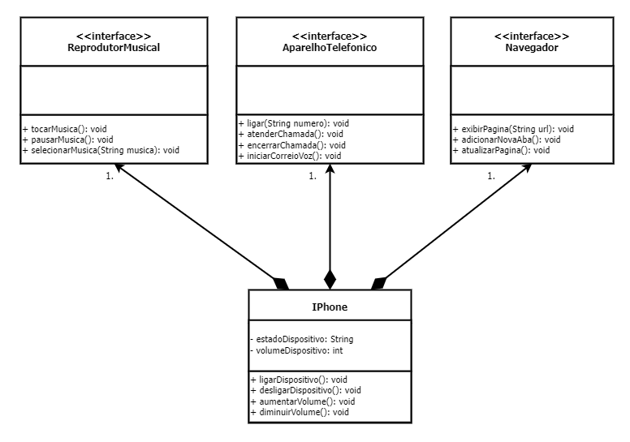

# DESAFIO: Modelando o iPhone com UML

Este repositório contém o projeto do desafio proposto pela **Digital Innovation One**. O objetivo é modelar um iPhone usando a linguagem de modelagem unificada (UML).

- **autor**: Jones Silva (@jhonestiago).

## Diagrama UML

O diagrama UML abaixo representa a estrutura e o comportamento do iPhone. Ele serve como uma ferramenta visual para entender melhor o sistema.

### Interfaces e suas Funcionalidades

1. **ReprodutorMusical:** Esta interface representa a funcionalidade de um reprodutor musical no iPhone. Ela define três métodos:
    - `tocarMusica()`: Este método é usado para iniciar a reprodução de uma música.
    - `pausarMusica()`: Este método é usado para pausar a reprodução de uma música.
    - `selecionarMusica(String musica)`: Este método é usado para selecionar uma música específica para reprodução.
2. **AparelhoTelefonico:** Esta interface representa a funcionalidade de um aparelho telefônico no iPhone. Ela define três métodos:
    - `ligar(String numero)`: Este método é usado para fazer uma ligação para um número específico.
    - `atenderChamada()`: Este método é usado para atender uma ligação recebida.
    - `iniciarCorreioVoz()`: Este método é usado para iniciar o correio de voz.
3. **Navegador:** Esta interface representa a funcionalidade de um navegador de internet no iPhone. Ela define três métodos:
    - `exibirPagina(String url)`: Este método é usado para exibir uma página da web específica.
    - `adicionarNovaAba()`: Este método é usado para adicionar uma nova aba no navegador.
    - `atualizarPagina()`: Este método é usado para atualizar a página da web atualmente exibida.

### Classe IPhone

A classe IPhone é a principal classe do diagrama. Ela se relaciona com as três interfaces mencionadas acima, indicando que um iPhone possui as funcionalidades de um Reprodutor Musical, um Aparelho Telefônico e um Navegador na Internet. Além disso, a classe iPhone possui os seguintes atributos e métodos:

1. **Atributos:**
    - `estadoDispositivo: String`: Este atributo representa o estado atual do dispositivo.
    - `volumeDispositivo: int`: Este atributo representa o volume atual do dispositivo.
2. **Métodos:**
    - `ligarDispositivo(): void`: Este método é usado para ligar o dispositivo.
    - `desligarDispositivo(): void`: Este método é usado para desligar o dispositivo.
    - `aumentarVolume(): void`: Este método é usado para aumentar o volume do dispositivo.
    - `diminuirVolume(): void`: Este método é usado para diminuir o volume do dispositivo.
